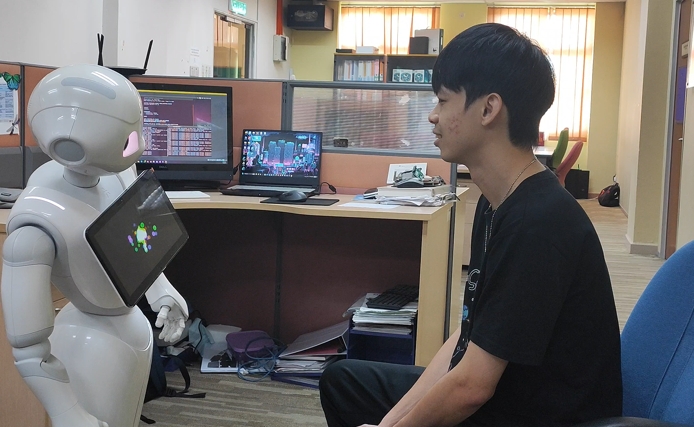
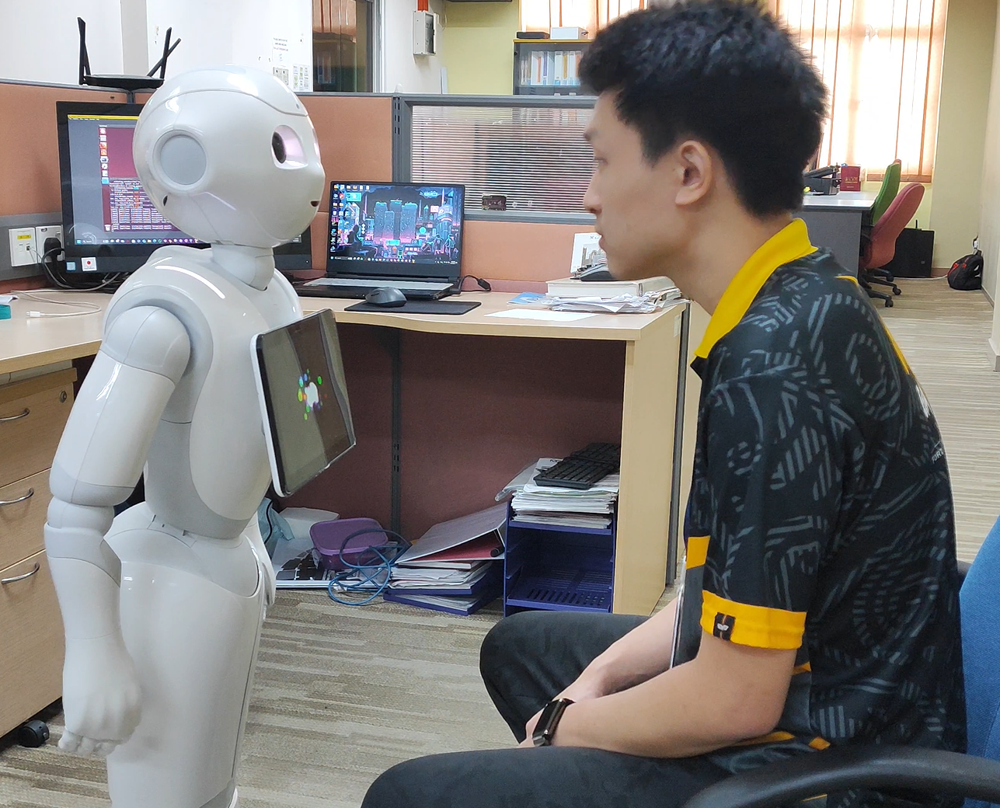

# ROS Wrapper and ChatGPT for Robot-controlled System


This project integrates ChatGPT, an advanced AI language model, with the Pepper robot using ROS Indigo and Python. The primary objective is to enhance human-robot interaction (HRI) by leveraging the capabilities of ChatGPT and overcoming the limitations of Pepper's built-in libraries.

## Table of Contents
1. [Project Overview](#project-overview)
2. [System Requirements](#system-requirements)
3. [Installation](#installation)
4. [Usage](#usage)
5. [Video Demonstration](#video-demonstration)
6. [Photo of Results](#photo-of-results)
7. [Project Information](#project-information)

## Project Overview

The project follows a systematic approach to integrate ChatGPT with the Pepper robot using ROS Indigo and Python. The process involves:
1. Resetting Pepper to factory settings and studying its functionalities.
2. Setting up a virtual environment using Oracle VM VirtualBox and installing ROS Indigo on Ubuntu 14.04.
3. Developing Python scripts for ROS integration and ChatGPT interaction.
4. Testing and optimizing the interaction in both English and Japanese.

## System Requirements

- Pepper Robot
- Ubuntu 14.04
- ROS Indigo
- Python 2.7 and Python 3.7
- Oracle VM VirtualBox
- Anaconda (for managing Python environments)

## Installation

### Step 1: Setting Up Virtual Machine
1. Download and install [Oracle VM VirtualBox](https://www.virtualbox.org/).
2. Create a virtual machine and install Ubuntu 14.04 using the ISO file.

### Step 2: Installing ROS Indigo
1. Follow the [official ROS Indigo installation guide](http://wiki.ros.org/indigo/Installation/Ubuntu).
2. Set up your `bashrc` file to source ROS Indigo:
    ```bash
    source /opt/ros/indigo/setup.bash
    ```

### Step 3: Creating Catkin Workspace
1. Create and initialize a catkin workspace:
    ```bash
    mkdir -p ~/catkin_ws/src
    cd ~/catkin_ws/
    catkin_make
    source devel/setup.bash
    ```

### Step 4: Installing Pepper SDK and Python Libraries
1. Install Pepper's Python SDK.
2. Install necessary Python libraries:
    ```bash
    pip install naoqi
    pip install openai==1.30.1
    ```

### Step 5: Setting Up Python Environments
1. Create a virtual environment for Python 3.7 using Anaconda:
    ```bash
    conda create -n open_ai python=3.7
    conda activate open_ai
    ```

## Usage

### Step 1: Running ROS Nodes
1. Start the ROS master node:
    ```bash
    roscore
    ```

2. Run the Python scripts to start interaction management:
    ```bash
    # In one terminal for Pepper robot
    rosrun peppercode Pepper.py

    # In another terminal for ChatGPT
    rosrun gpt3_node ChatGPT.py
    ```

### Step 2: Interacting with Pepper
1. Ensure the Pepper robot is connected and operational.
2. Initiate conversation through the designated input method.
3. Observe Pepper's responses and motions triggered by ChatGPT's outputs.

## Video Demonstration

[Pepper Robot ChatGPT Integration](https://www.youtube.com/watch?v=719isX3GuOk&ab_channel=TeeKhekHeng)

## Photo of Results


*Figure 1: Pepper Robot Waving Hand in front of User*


*Figure 2: Pepper Robot Dancing in front of User*


*Figure 3: Pepper Robot Bowing to the User*


*Figure 4: Pepper Robot Shaking Hand with the User*

## Project Information

| Project lead           | TEE KHEK HENG                      |
|------------------------|------------------------------------|
| Matric No              | A20MJ0111                          |
| Project Supervisor     | Assoc Prof Ir Dr Zool Hilmi Ismail |
| Course Code            | SMJE 4924 - Final Year Project 2   |
